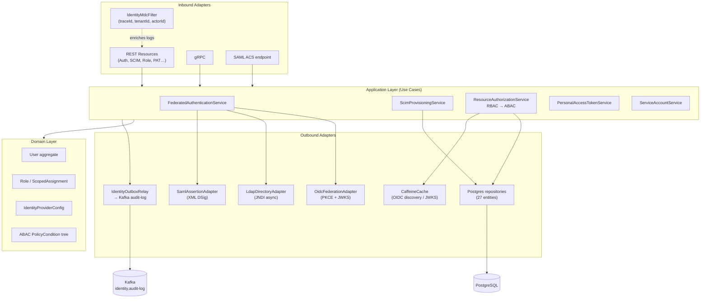

# Numou Identity System

---

## Architecture Diagram (Current State)

```mermaid
graph TD
    subgraph Inbound["Inbound Adapters"]
        REST["REST Resources\n(Auth, SCIM, Role, PAT…)"]
        GRPC["gRPC"]
        MDC["IdentityMdcFilter\n(traceId, tenantId, actorId)"]
        SAML_IN["SAML ACS endpoint"]
    end

    subgraph App["Application Layer (Use Cases)"]
        FAS["FederatedAuthenticationService"]
        SCIM["ScimProvisioningService"]
        RAS["ResourceAuthorizationService\nRBAC → ABAC"]
        PAT["PersonalAccessTokenService"]
        SA["ServiceAccountService"]
    end

    subgraph Domain["Domain Layer"]
        User["User aggregate"]
        Role["Role / ScopedAssignment"]
        IDP["IdentityProviderConfig"]
        ABAC_D["ABAC PolicyCondition tree"]
    end

    subgraph Outbound["Outbound Adapters"]
        PG["Postgres repositories\n(27 entities)"]
        OIDC_A["OidcFederationAdapter\n(PKCE + JWKS)"]
        LDAP_A["LdapDirectoryAdapter\n(JNDI async)"]
        SAML_A["SamlAssertionAdapter\n(XML DSig)"]
        OUTBOX["IdentityOutboxRelay\n→ Kafka audit-log"]
        CACHE["CaffeineCache\n(OIDC discovery / JWKS)"]
    end

    REST --> App
    GRPC --> App
    SAML_IN --> App
    MDC -.->|enriches logs| REST

    App --> Domain
    FAS --> OIDC_A
    FAS --> LDAP_A
    FAS --> SAML_A
    SCIM --> PG
    RAS --> PG
    RAS --> CACHE
    App --> OUTBOX
    OUTBOX --> Kafka[(Kafka\nidentity.audit-log)]
    PG --> DB[(PostgreSQL)]
```
